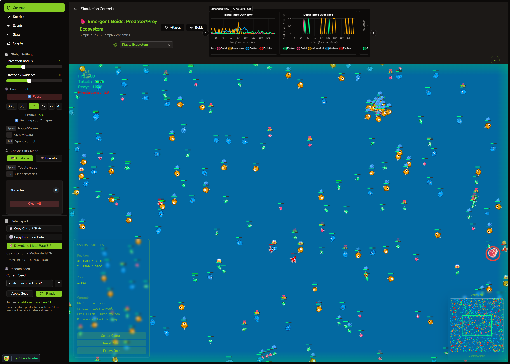
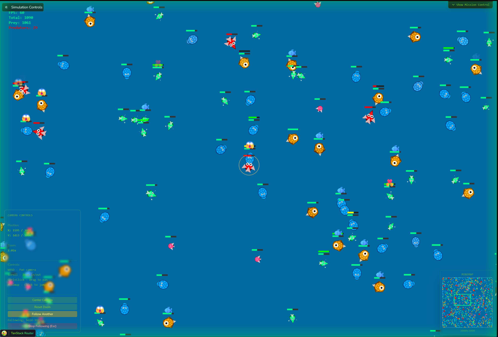
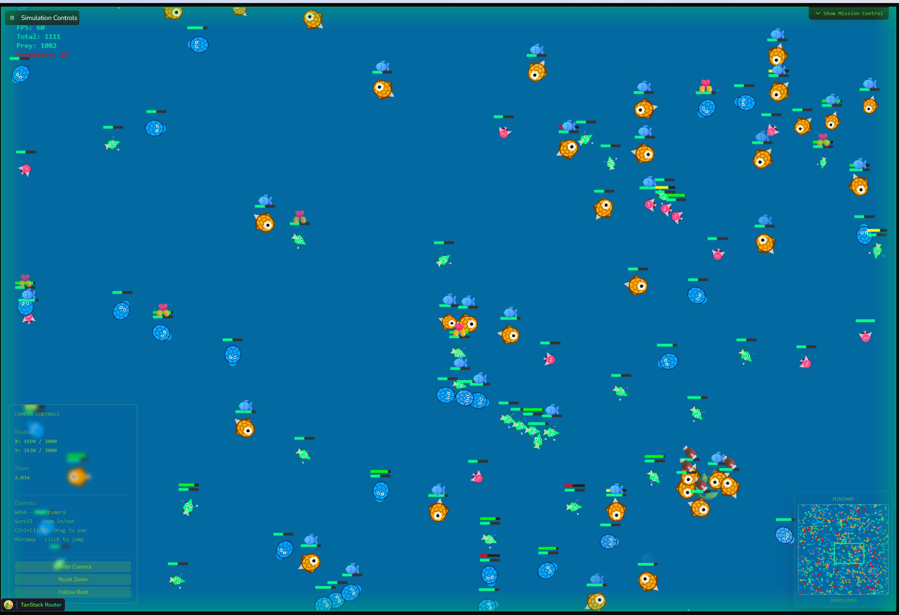
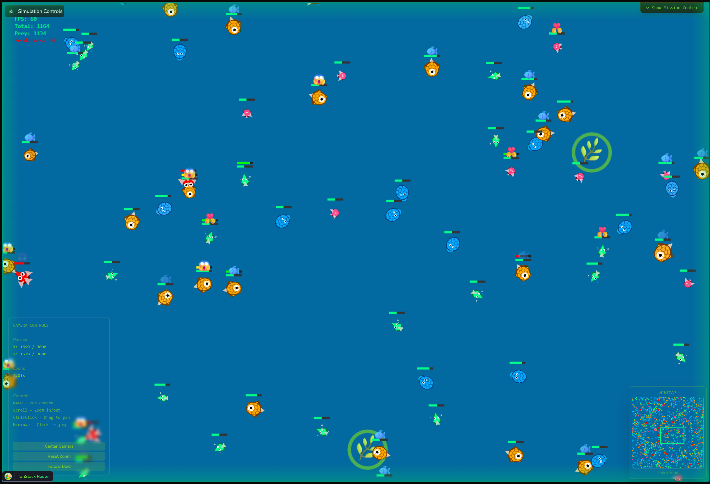

# Emergent Boids

An ecosystem simulation where complex behavior emerges from simple rules. Watch boids flock, hunt, reproduce, and evolve in real-time.

## Overview

Emergent Boids demonstrates how sophisticated patterns arise from minimal instructions. Based on Craig Reynolds' 1987 Boids algorithm, this simulation extends the original flocking behavior with predator-prey dynamics, genetic inheritance, and natural selection.

The result is a living ecosystem where populations adapt over generations, visual traits carry mechanical significance, and survival strategies emerge without explicit programming.

## Screenshots

| | |
|:--:|:--:|
|  |  |
|  |  |

<p align="center">
  
</p>

## Features

- **Genetic Inheritance** - Offspring inherit traits from parents with random mutations
- **Predator-Prey Dynamics** - Combat system with health, damage, and knockback
- **Real-time Evolution** - Natural selection shapes populations over generations
- **WebGL Rendering** - Handles thousands of boids at 60 FPS
- **Dual Execution Modes** - Single-threaded for debugging, multi-threaded for performance
- **Python Analysis Toolkit** - Export simulation data for machine learning and statistical analysis

## Quick Start

```bash
npm install
npm run dev
```

Open `http://localhost:5173` to view the simulation.

## The Algorithm

Craig Reynolds' Boids algorithm (1987) demonstrated that realistic flocking behavior emerges from three simple rules:

1. **Separation** - Avoid crowding nearby flockmates
2. **Alignment** - Steer toward the average heading of nearby flockmates
3. **Cohesion** - Steer toward the average position of nearby flockmates

This simulation extends those rules with:

- **Fear** - Prey flee from approaching predators
- **Chase** - Predators pursue nearby prey
- **Combat** - Health-based damage system with knockback
- **Genetics** - Heritable traits that affect speed, vision, size, and behavior
- **Evolution** - Populations adapt through natural selection

## Architecture

Built with three custom libraries that demonstrate the principle "simple rules compose":

### braided

Resource composition with explicit dependency management. Resources declare their dependencies, and the system handles initialization order and lifecycle automatically.

```typescript
export const engine = defineResource({
  dependencies: ['runtimeStore', 'profiler', 'randomness'],
  start: ({ runtimeStore, profiler, randomness }) => {
    // Engine implementation
  },
  halt: (engine) => {
    // Cleanup
  }
});
```

### emergent

Event-driven state management where complex patterns emerge from simple handlers. Events are past-tense facts, handlers are pure functions that return effects.

```typescript
runtimeController.dispatch({ 
  type: 'boids/reproduced', 
  payload: { parentId, offspringId } 
});

runtimeController.subscribe((event) => {
  if (event.type === 'boids/reproduced') {
    trackBirth(event);
  }
});
```

### braided-react

React integration for braided resources, providing Suspense-based loading and clean separation of concerns.

## Core Philosophy

"Everything is information processing. Simple rules compose. Emergence is reliable. No central governor needed."

This philosophy guides the architecture:

- **Pure functions** for simulation logic (`src/boids/`)
- **Thin adapters** for environment-specific code (`src/resources/`)
- **Single source of truth** - Core module used by both browser and worker engines
- **Explicit dependencies** - No hidden coupling between systems
- **Emergent complexity** - Sophisticated behavior from minimal rules

## Project Structure

```
src/
  boids/              # Pure simulation logic
    genetics/         # Genome, phenotype, inheritance
    lifecycle/        # Aging, energy, health, reproduction
    behavior/         # Flocking rules, decision making
    engine/           # Core simulation functions
  resources/          # Environment-specific adapters
    browser/          # Single-threaded engine
    worker/           # Multi-threaded engine
    webgl/            # Modular WebGL renderer
  components/         # React UI components
  systems/            # Resource composition configurations
  profiles/           # Simulation presets

analyzer/             # Python analysis toolkit
  src/ml/             # Data loading, feature engineering, models
  src/notebooks/      # Jupyter notebooks for analysis
  datasets/           # Exported simulation data (JSONL)
```

## Documentation

- [Architecture](docs/ARCHITECTURE.md) - How braided and emergent manage system complexity
- [Genetics System](docs/GENETICS.md) - How evolution emerges from inheritance and mutation
- [Concurrency Models](docs/CONCURRENCY.md) - Browser vs Worker engine comparison
- [Boids Algorithm](docs/BOIDS_ALGORITHM.md) - Reynolds' original work and our extensions

## Development

```bash
# Frontend (TypeScript/React)
npm run dev          # Start dev server (Vite)
npm run build        # Type-check + build
npm run lint         # ESLint
npm run type:check   # Type-check only
npm run preview      # Preview production build

# Python Analyzer
cd analyzer
uv run generate_full_report.py <dataset_folder>  # Generate analysis report
uv run jupyter lab                                # Start Jupyter notebooks
```

## Performance Profiling

The simulation includes a built-in profiler accessible via `window.profiler` in the browser console:

```javascript
// Enable profiling for 60 frames
profiler.startSession(60);

// After simulation runs
profiler.printCumulativeSummary();  // Shows aggregated metrics
profiler.printSummary();            // Shows per-operation averages
```

## Browser vs Worker Engines

The simulation includes two execution modes:

**Browser Engine** (single-threaded)
- Simpler architecture, easier to debug
- Direct event dispatching
- Good for up to ~1000 boids at 60 FPS
- Default mode

**Worker Engine** (multi-threaded)
- Physics computation in Web Worker
- SharedArrayBuffer for zero-copy state sync
- Scales to 5000+ boids at 60 FPS
- Frees main thread for UI and rendering

Both engines use identical simulation logic from `src/boids/engine/core.ts`. The only differences are environmental: how they communicate and where they run.

## Data Export

Export simulation data for analysis:

1. Run simulation with desired configuration
2. Click "Export Data" in the UI
3. Choose export format (JSONL or multi-rate ZIP)
4. Analyze with Python toolkit in `analyzer/`

The multi-rate export includes multiple sampling rates (1x, 3x, 10x, 50x, 100x) for different analysis needs. Use 10x for production machine learning models.

## Related Projects

- [braided](https://github.com/RegiByte/braided) - Resource composition library
- [braided-react](https://github.com/RegiByte/braided-react) - React adapter for braided
- [emergent](https://github.com/RegiByte/emergent) - Event-driven state management

## Credits

- Craig Reynolds for the original Boids algorithm (1987)
- "Flocks, Herds, and Schools: A Distributed Behavioral Model" - SIGGRAPH '87

## LLM Usage Disclaimer

This project made heavy use of LLMs to generate code, refactor, plan the architecture, run experiments, cleanup unused code and other tasks. While the LLMs were a huge help, they are not a substitute for human understanding and oversight. The code is not perfect and there are likely bugs and inefficiencies.

Despite the use of LLMs, the ideas of the project are mine, the research of the boids algorithm and the genetics system are mine, the libraries used for the architecture foundation are mine, and the discipline to refactor and clean up when necessary are also mine. The LLM does not replace my capability to think, reason, and make decisions, therefore I consider it my execution partner, not my replacement.

Model used: Claude 4.5 Sonnet (no thinking mode)

## License

ISC
