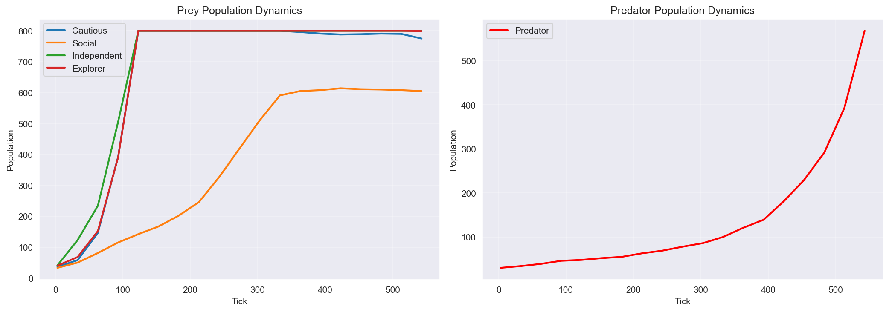
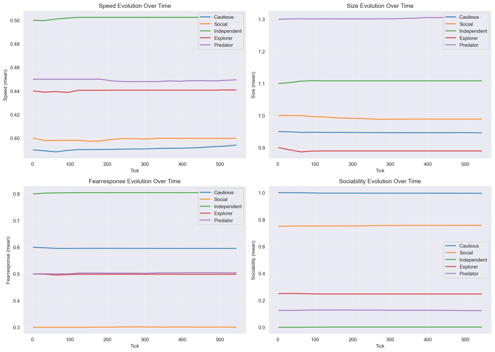
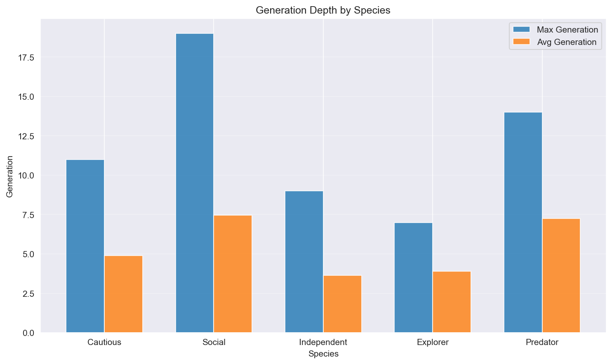
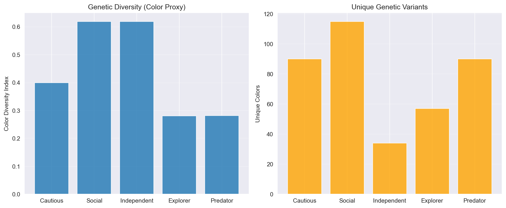

# Evolution Analysis Report

**Generated:** 2025-12-29 17:59:06  
**Dataset:** evolution_1767040734262  
**Duration:** 5.53 minutes (543 ticks)

---

## 📊 Population Dynamics

### Final Populations

| Species | Initial | Final | Growth |
|---------|---------|-------|--------|
| Cautious | 36 | 769 | +2036.1% |
| Social | 33 | 607 | +1739.4% |
| Independent | 41 | 800 | +1851.2% |
| Explorer | 40 | 800 | +1900.0% |
| Predator | 30 | 604 | +1913.3% |

**Total Population:** 3580  
**Prey:Predator Ratio:** 4.93:1

---

## 🧬 Trait Evolution

### Key Trait Changes

#### Cautious

| Trait | Mean | StdDev | Range |
|-------|------|--------|-------|
| speed | 0.394 | 0.019 | 0.304 - 0.511 |
| size | 0.946 | 0.050 | 0.611 - 1.211 |
| fearResponse | 0.596 | 0.018 | 0.502 - 0.699 |
| sociability | 0.995 | 0.014 | 0.893 - 1.000 |

#### Social

| Trait | Mean | StdDev | Range |
|-------|------|--------|-------|
| speed | 0.400 | 0.014 | 0.311 - 0.498 |
| size | 0.989 | 0.049 | 0.760 - 1.233 |
| fearResponse | 0.300 | 0.014 | 0.205 - 0.390 |
| sociability | 0.757 | 0.018 | 0.677 - 0.865 |

#### Independent

| Trait | Mean | StdDev | Range |
|-------|------|--------|-------|
| speed | 0.502 | 0.030 | 0.404 - 0.676 |
| size | 1.108 | 0.073 | 0.854 - 1.622 |
| fearResponse | 0.805 | 0.029 | 0.706 - 0.942 |
| sociability | 0.001 | 0.008 | 0.000 - 0.080 |

#### Explorer

| Trait | Mean | StdDev | Range |
|-------|------|--------|-------|
| speed | 0.441 | 0.015 | 0.345 - 0.530 |
| size | 0.890 | 0.040 | 0.650 - 1.133 |
| fearResponse | 0.499 | 0.022 | 0.403 - 0.618 |
| sociability | 0.247 | 0.017 | 0.124 - 0.346 |

#### Predator

| Trait | Mean | StdDev | Range |
|-------|------|--------|-------|
| speed | 0.450 | 0.014 | 0.356 - 0.587 |
| size | 1.306 | 0.034 | 1.058 - 1.548 |
| fearResponse | 0.504 | 0.017 | 0.379 - 0.597 |
| sociability | 0.124 | 0.019 | 0.033 - 0.218 |

---

## 🎯 Selection Pressures

### Cautious

- **size**: Active selection (CV: 0.052, σ: 0.0495)
- **force**: Active selection (CV: 0.061, σ: 0.0148)
- **aggression**: Active selection (CV: 0.065, σ: 0.0194)

### Social

- **size**: Moderate selection (CV: 0.049, σ: 0.0487)
- **aggression**: Active selection (CV: 0.070, σ: 0.0214)

### Independent

- **speed**: Active selection (CV: 0.061, σ: 0.0305)
- **size**: Active selection (CV: 0.066, σ: 0.0730)
- **vision**: Active selection (CV: 0.058, σ: 0.0291)
- **force**: Active selection (CV: 0.081, σ: 0.0245)
- **aggression**: Active selection (CV: 0.083, σ: 0.0247)
- **sociability**: Active selection (CV: 6.830, σ: 0.0079)
- **efficiency**: Moderate selection (CV: 0.046, σ: 0.0232)
- **fearResponse**: Moderate selection (CV: 0.036, σ: 0.0292)
- **longevity**: Active selection (CV: 0.051, σ: 0.0257)

### Explorer

- **size**: Moderate selection (CV: 0.044, σ: 0.0395)
- **force**: Active selection (CV: 0.092, σ: 0.0187)
- **sociability**: Active selection (CV: 0.067, σ: 0.0165)
- **fearResponse**: Moderate selection (CV: 0.044, σ: 0.0222)

### Predator

- **size**: Moderate selection (CV: 0.026, σ: 0.0340)
- **sociability**: Active selection (CV: 0.151, σ: 0.0187)

---

## 🔢 Generation Depth

| Species | Max Gen | Avg Gen | Interpretation |
|---------|---------|---------|----------------|
| Cautious | 11 | 4.90 | Active evolution |
| Social | 19 | 7.45 | Deep evolution |
| Independent | 9 | 3.64 | Active evolution |
| Explorer | 7 | 3.91 | Shallow evolution |
| Predator | 14 | 7.25 | Active evolution |

---

## 🌈 Genetic Diversity

| Species | Color Diversity | Unique Colors |
|---------|-----------------|---------------|
| Cautious | 0.400 | 90 |
| Social | 0.618 | 115 |
| Independent | 0.619 | 34 |
| Explorer | 0.281 | 57 |
| Predator | 0.281 | 90 |

---

## 👶 Reproduction Strategies

| Species | Type | Max Gen | Avg Gen |
|---------|------|---------|----------|
| Explorer | Sexual | 7 | 3.91 |
| Social | Sexual | 19 | 7.45 |
| Independent | Asexual | 9 | 3.64 |
| Cautious | Sexual | 11 | 4.90 |
| Predator | Sexual | 14 | 7.25 |

---

## 💡 Key Insights

- **Cautious population exploded** (+2036.1%)
- **Social population exploded** (+1739.4%)
- **Independent population exploded** (+1851.2%)
- **Explorer population exploded** (+1900.0%)
- **Predator population exploded** (+1913.3%)
- **Deepest evolution**: Social reached Gen 19
- **Highest genetic diversity**: Independent (0.619)

---

*Report generated by Evolution Report Generator v1.0*  
*Data: evolution_1767040734262*
