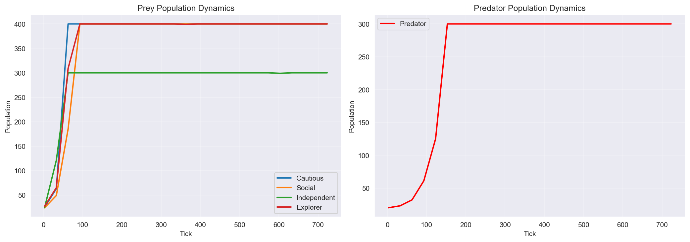
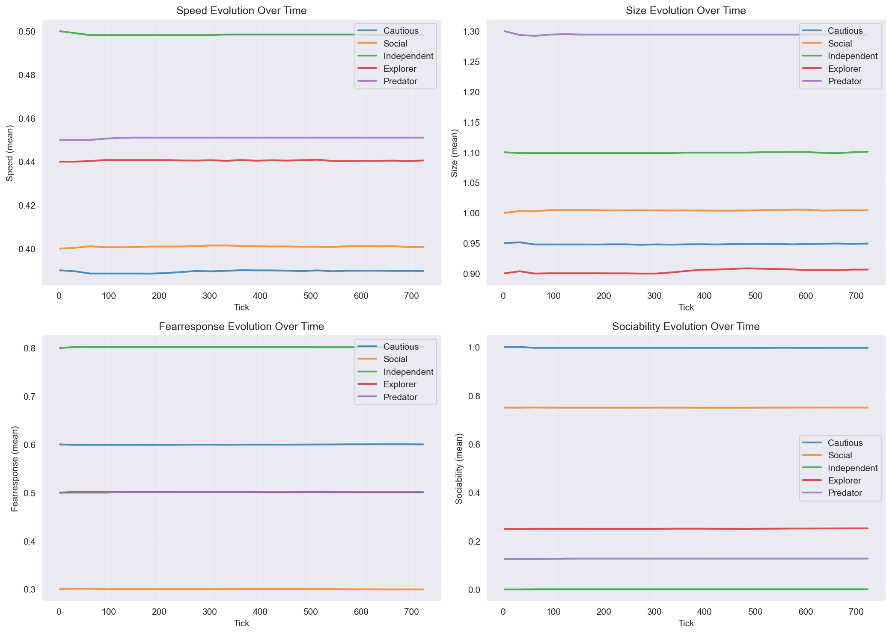
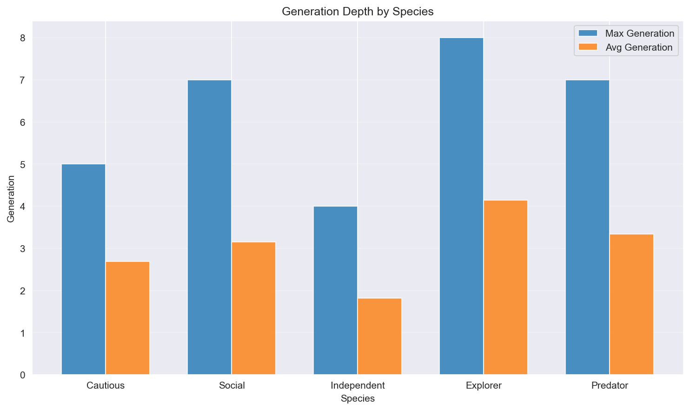
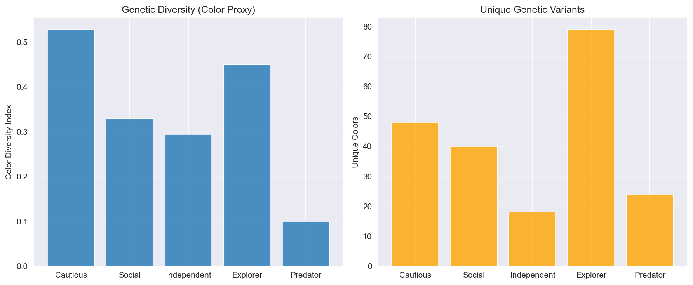

# Evolution Analysis Report

**Generated:** 2025-12-29 18:09:15  
**Dataset:** evolution_1767042485234  
**Duration:** 6.92 minutes (744 ticks)

---

## 📊 Population Dynamics

### Final Populations

| Species | Initial | Final | Growth |
|---------|---------|-------|--------|
| Cautious | 25 | 399 | +1496.0% |
| Social | 24 | 400 | +1566.7% |
| Independent | 24 | 300 | +1150.0% |
| Explorer | 27 | 399 | +1377.8% |
| Predator | 20 | 300 | +1400.0% |

**Total Population:** 1798  
**Prey:Predator Ratio:** 4.99:1

---

## 🧬 Trait Evolution

### Key Trait Changes

#### Cautious

| Trait | Mean | StdDev | Range |
|-------|------|--------|-------|
| speed | 0.390 | 0.011 | 0.303 - 0.478 |
| size | 0.951 | 0.044 | 0.712 - 1.195 |
| fearResponse | 0.600 | 0.009 | 0.521 - 0.675 |
| sociability | 0.997 | 0.013 | 0.901 - 1.000 |

#### Social

| Trait | Mean | StdDev | Range |
|-------|------|--------|-------|
| speed | 0.401 | 0.009 | 0.300 - 0.470 |
| size | 1.004 | 0.036 | 0.740 - 1.226 |
| fearResponse | 0.299 | 0.013 | 0.206 - 0.387 |
| sociability | 0.750 | 0.013 | 0.655 - 0.839 |

#### Independent

| Trait | Mean | StdDev | Range |
|-------|------|--------|-------|
| speed | 0.498 | 0.016 | 0.407 - 0.563 |
| size | 1.101 | 0.038 | 0.905 - 1.335 |
| fearResponse | 0.801 | 0.016 | 0.702 - 0.891 |
| sociability | 0.001 | 0.006 | 0.000 - 0.064 |

#### Explorer

| Trait | Mean | StdDev | Range |
|-------|------|--------|-------|
| speed | 0.440 | 0.018 | 0.338 - 0.535 |
| size | 0.906 | 0.041 | 0.657 - 1.139 |
| fearResponse | 0.501 | 0.018 | 0.407 - 0.600 |
| sociability | 0.252 | 0.018 | 0.173 - 0.350 |

#### Predator

| Trait | Mean | StdDev | Range |
|-------|------|--------|-------|
| speed | 0.451 | 0.016 | 0.381 - 0.541 |
| size | 1.294 | 0.034 | 1.068 - 1.471 |
| fearResponse | 0.501 | 0.009 | 0.433 - 0.580 |
| sociability | 0.127 | 0.015 | 0.039 - 0.223 |

---

## 🎯 Selection Pressures

### Cautious

- **size**: Moderate selection (CV: 0.046, σ: 0.0441)

### Social

- **size**: Moderate selection (CV: 0.036, σ: 0.0359)
- **aggression**: Active selection (CV: 0.052, σ: 0.0156)

### Independent

- **size**: Moderate selection (CV: 0.035, σ: 0.0383)
- **aggression**: Active selection (CV: 0.057, σ: 0.0170)
- **sociability**: Active selection (CV: 8.741, σ: 0.0056)
- **maturityRate**: Active selection (CV: 0.061, σ: 0.0309)

### Explorer

- **size**: Moderate selection (CV: 0.045, σ: 0.0409)
- **force**: Active selection (CV: 0.085, σ: 0.0170)
- **aggression**: Active selection (CV: 0.062, σ: 0.0184)
- **sociability**: Active selection (CV: 0.072, σ: 0.0181)
- **maturityRate**: Moderate selection (CV: 0.046, σ: 0.0231)

### Predator

- **size**: Moderate selection (CV: 0.026, σ: 0.0342)
- **sociability**: Active selection (CV: 0.122, σ: 0.0155)

---

## 🔢 Generation Depth

| Species | Max Gen | Avg Gen | Interpretation |
|---------|---------|---------|----------------|
| Cautious | 5 | 2.69 | Shallow evolution |
| Social | 7 | 3.15 | Shallow evolution |
| Independent | 4 | 1.82 | Shallow evolution |
| Explorer | 8 | 4.14 | Shallow evolution |
| Predator | 7 | 3.34 | Shallow evolution |

---

## 🌈 Genetic Diversity

| Species | Color Diversity | Unique Colors |
|---------|-----------------|---------------|
| Cautious | 0.528 | 48 |
| Social | 0.329 | 40 |
| Independent | 0.294 | 18 |
| Explorer | 0.449 | 79 |
| Predator | 0.100 | 24 |

---

## 👶 Reproduction Strategies

| Species | Type | Max Gen | Avg Gen |
|---------|------|---------|----------|
| Explorer | Sexual | 8 | 4.14 |
| Social | Sexual | 7 | 3.15 |
| Independent | Asexual | 4 | 1.82 |
| Cautious | Sexual | 5 | 2.69 |
| Predator | Sexual | 7 | 3.34 |

---

## 💡 Key Insights

- **Cautious population exploded** (+1496.0%)
- **Social population exploded** (+1566.7%)
- **Independent population exploded** (+1150.0%)
- **Explorer population exploded** (+1377.8%)
- **Predator population exploded** (+1400.0%)
- **Deepest evolution**: Explorer reached Gen 8
- **Highest genetic diversity**: Cautious (0.528)

---

*Report generated by Evolution Report Generator v1.0*  
*Data: evolution_1767042485234*
