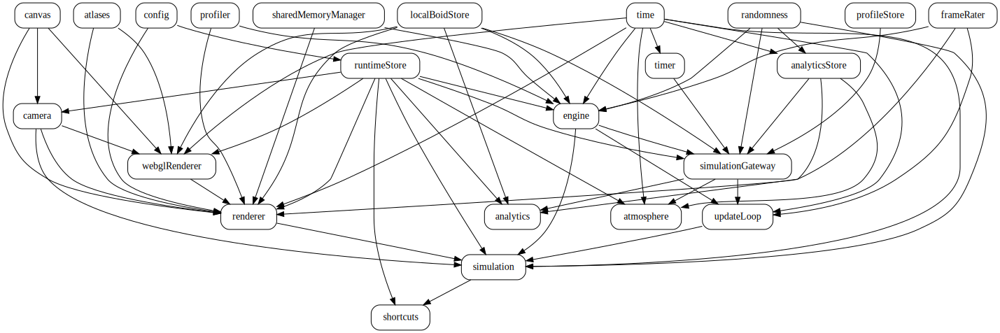
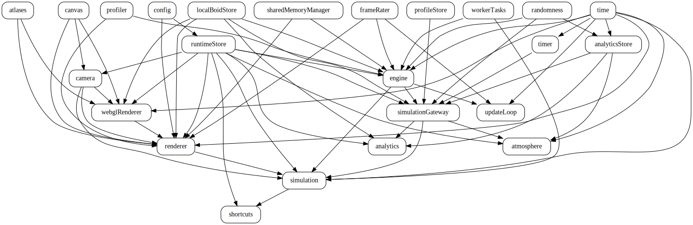
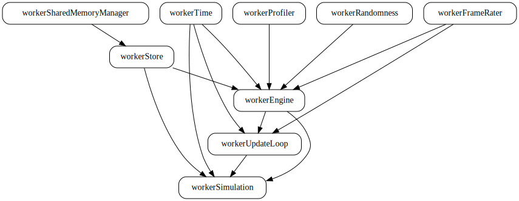

# Architecture

This document explains how Emergent Boids manages complexity through resource composition, event-driven state, and pure functional design.

## Core Philosophy

"Everything is information processing. Simple rules compose. Emergence is reliable. No central governor needed."

This philosophy manifests in three architectural principles:

1. **Pure functions** for simulation logic - No side effects, deterministic, testable
2. **Explicit dependencies** - Resources declare what they need, no hidden coupling
3. **Emergent complexity** - Sophisticated behavior from minimal rules

## The Three Libraries

### braided - Resource Composition

Braided manages stateful resources with explicit dependencies and automatic lifecycle management.

**Key Concepts:**

- Resources declare their dependencies
- System resolves initialization order via topological sort
- Clean startup and shutdown sequences
- No circular dependencies allowed

**Example:**

```typescript
export const engine = defineResource({
  dependencies: ['runtimeStore', 'profiler', 'randomness'],
  start: ({ runtimeStore, profiler, randomness }) => {
    // Initialize engine with dependencies
    return {
      update: () => { /* ... */ },
      reset: () => { /* ... */ },
    };
  },
  halt: (engine) => {
    // Clean shutdown
  }
});
```

**Benefits:**

- Dependency order is explicit and enforced
- Resources start in correct order automatically
- Shutdown happens in reverse order
- No manual coordination needed

### emergent - Event-Driven State

Emergent provides event-driven state management where complex patterns emerge from simple handlers.

**Key Concepts:**

- Events are past-tense facts (what happened)
- Handlers are pure functions (return effects)
- Executors apply side effects
- Observers subscribe to event streams

**Example:**

```typescript
// Dispatch an event (past-tense)
runtimeController.dispatch({ 
  type: 'boids/reproduced', 
  payload: { parentId, offspringId, generation } 
});

// Subscribe to events
runtimeController.subscribe((event) => {
  if (event.type === 'boids/reproduced') {
    analytics.trackBirth(event);
    atmosphere.incrementBirthCounter(event);
  }
});
```

**Benefits:**

- Decoupled observers - Add new observers without changing existing code
- Composable - Multiple observers can react to same events
- Testable - Each observer is independent
- Scalable - Supports many observers without degrading

### braided-react - React Integration

Braided-react integrates braided resources with React's component lifecycle.

**Key Concepts:**

- Suspense-based resource loading
- Resources independent of React lifecycle
- Clean separation of concerns
- No prop drilling

**Example:**

```typescript
function MyComponent() {
  const runtimeStore = useResource('runtimeStore');
  const { useStore } = runtimeStore;
  const boidCount = useStore((state) => state.boids.length);
  
  return <div>Boids: {boidCount}</div>;
}
```

## System Architecture

### Resource Dependency Graph

The complete system dependency graph shows how resources compose. Yes, it's complex. But every arrow is explicit, every dependency is declared, and the entire startup/shutdown sequence is deterministic.

**Browser Engine (Standard System):**



*Generated from system topology using Graphviz. This visualization shows all resources and their explicit dependencies.*

**Worker Engine (Parallel System):**



*The parallel system adds `workerTasks` and modifies the engine configuration for multi-threaded execution.*

**Worker Thread System:**



*Inside the Web Worker, a minimal system runs with only what's needed for physics computation: the worker engine, stores, profiler, randomness, and time. No rendering, no UI, no analytics.*

**Key Points:**

- Resources declare dependencies explicitly
- No circular dependencies (enforced by braided)
- Start order determined automatically via topological sort
- Halt order is reverse of start
- Observers (`analytics`, `atmosphere`, `shortcuts`) are leaf nodes - they watch but don't block

### Information Flow

```
User Action / Time Passage
        ↓
Event Dispatch (past-tense)
        ↓
Event Handler (pure function)
        ↓
Effects (data describing changes)
        ↓
Effect Executor (side effects)
        ↓
State Update (Zustand + Immer)
        ↓
Observers React (analytics, atmosphere)
        ↓
React Re-renders
        ↓
Visual Output (canvas + UI)
```

No central controller coordinates this flow. Information propagates naturally through the system.

## Pure vs Impure Separation

### Pure Functions (src/boids/)

All simulation logic is pure:

- No side effects
- No mutations
- Deterministic (same input → same output)
- Easy to test

**Example:**

```typescript
// Pure - Returns new value
export function updateBoidEnergy(
  boid: Boid,
  typeConfig: BoidTypeConfig,
  deltaSeconds: number
): number {
  return boid.energy + typeConfig.energyGainRate * deltaSeconds;
}

// Pure - Returns data describing changes
export function processLifecycleUpdates(
  boids: Boid[],
  config: BoidConfig,
  deltaSeconds: number
): LifecycleChanges {
  return {
    boidsToRemove: [...],
    boidsToAdd: [...],
    events: [...],
  };
}
```

### Impure Functions (src/resources/)

Side effects are isolated to resource adapters:

- Mutations allowed
- Side effects expected
- Call pure functions for logic

**Example:**

```typescript
// Impure - Mutates state, dispatches events
export function applyLifecycleChanges(
  changes: LifecycleChanges
): void {
  for (const boidId of changes.boidsToRemove) {
    engine.removeBoid(boidId);
  }
  for (const boid of changes.boidsToAdd) {
    engine.addBoid(boid);
  }
  for (const event of changes.events) {
    dispatch(event);
  }
}
```

## Core/Adapter Pattern

The project uses a core/adapter pattern to eliminate code duplication between execution modes.

### Before: Duplicated Logic

```
Browser Engine (851 lines)          Worker Engine (1,027 lines)
├─ Behavior evaluation             ├─ Behavior evaluation (DUPLICATE)
├─ Combat system                   ├─ Combat system (DUPLICATE)
├─ Lifecycle events                ├─ Lifecycle events (DUPLICATE)
├─ Food management                 ├─ Food management (DUPLICATE)
├─ Event dispatching (UNIQUE)      ├─ Message passing (UNIQUE)
└─ State management (UNIQUE)       └─ SharedArrayBuffer sync (UNIQUE)
```

Problem: 70% code duplication, drift risk, double maintenance.

### After: Unified Core

```
Core Module (674 lines - Pure Functions)
├─ evaluateBoidBehaviorCore()
├─ processPredatorAttack()
├─ updateBoidCooldowns()
├─ applyLifecycleEventsCore()
├─ generatePreyFoodBatch()
└─ ... all simulation logic
         ↓
    ┌────┴────┐
    ↓         ↓
Browser      Worker
Adapter      Adapter
(649 lines)  (870 lines)
    ↓         ↓
Events    Messages
State     SharedArrayBuffer
```

**Benefits:**

- Single source of truth - Zero duplication
- Zero drift risk - Fix once, both benefit
- Easier testing - Test core functions once
- Easier optimization - Optimize once, both benefit

### Core Functions

All shared simulation logic lives in `src/boids/engine/core.ts`:

```typescript
// Behavior evaluation
export const evaluateBoidBehaviorCore = (
  boid: Boid,
  context: BoidUpdateContext,
  config: ConfigContext,
  behaviorRuleset: BehaviorRuleset,
  currentFrame: number,
  boidsCount: number,
  profiler?: Profiler
): void => {
  // Filter nearby predators/prey
  // Build flock list
  // Evaluate behavior decision
  // Apply stance changes
}

// Combat system
export const processPredatorAttack = (
  predator: Boid,
  nearbyPrey: ItemWithDistance<Boid>[],
  config: ConfigContext,
  lifecycleCollector: LifecycleCollector
): void => {
  // Handle damage calculation
  // Apply knockback physics
  // Collect death events
  // Enforce attack cooldown
}

// Lifecycle event application
export const applyLifecycleEventsCore = (
  events: LifecycleEvent[],
  context: {
    boids: BoidsById
    config: ConfigContext
    currentFrame: number
    rng: DomainRNG
    getNextBoidIndex: () => number
  }
): LifecycleApplicationResult => {
  // Process deaths (remove boids)
  // Process reproductions (create offspring with genetics)
  // Process food consumption (update energy)
  // Return changes for adapters to apply
}
```

### Adapters

Browser and worker engines are thin adapters over core logic:

**Browser Adapter (src/resources/browser/engine.ts):**

```typescript
// Call core function
const result = applyLifecycleEventsCore(events, context);

// Apply changes (browser-specific)
for (const boid of result.boidsToAdd) {
  addBoid(boid);
}

// Dispatch events (browser-specific)
engineEventSubscription.notify({
  type: 'boids/reproduced',
  payload: { ... }
});
```

**Worker Adapter (src/resources/worker/workerEngine.ts):**

```typescript
// Call same core function
const result = applyLifecycleEventsCore(events, context);

// Apply changes (worker-specific)
for (const boid of result.boidsToAdd) {
  addBoid(boid);
}

// Send message (worker-specific)
simulationChannel?.out.notify({
  type: 'boids/reproduced',
  payload: { ... }
});
```

## The Observer Pattern

Observers subscribe to event streams without interfering with core logic.

**Example: Analytics Observer**

```typescript
const unsubscribe = runtimeController.subscribe((event) => {
  if (event.type === 'boids/reproduced') {
    analytics.trackBirth(event);
  }
  if (event.type === 'boids/died') {
    analytics.trackDeath(event);
  }
});
```

**Example: Atmosphere Observer**

```typescript
const unsubscribe = runtimeController.subscribe((event) => {
  if (event.type === 'boids/reproduced') {
    atmosphere.incrementBirthCounter(event);
  }
  if (event.type === 'boids/died') {
    atmosphere.incrementDeathCounter(event);
  }
});
```

**Benefits:**

- Composable - Add observers without changing existing code
- Decoupled - Observers don't know about each other
- Testable - Each observer is independent
- Scalable - Add unlimited observers

## Single Source of Truth

RuntimeStore is the authoritative source for all runtime state.

**Before:** Config vs RuntimeStore confusion

```typescript
// Config provides initial values
export const config: BoidConfig = { ... };

// But which is authoritative at runtime?
const speed = config.types.prey.maxSpeed;  // Static
const speed = runtimeStore.types.prey.maxSpeed;  // Runtime
```

**After:** RuntimeStore is authoritative

```typescript
// Config provides initial values only
export const config: BoidConfig = { ... };

// RuntimeStore is the runtime authority
export const runtimeStore = defineResource({
  start: () => {
    const store = create<RuntimeStore>()((set) => ({
      state: {
        types: config.types,  // Copy from config on startup
        parameters: config.parameters,
        // ... all runtime state
      },
    }));
  }
});

// Always read from RuntimeStore at runtime
const speed = runtimeStore.store.getState().config.types.prey.maxSpeed;
```

**Benefits:**

- No confusion about which source to read
- All settings are runtime-tweakable
- Foundation for UI controls
- Consistent state access pattern

## Key Design Patterns

### Event Naming Convention

Events are past-tense and describe what happened:

```typescript
// Good
{ type: 'boids/reproduced', parentId, offspringId }
{ type: 'boids/died', boidId, cause }
{ type: 'atmosphere/eventStarted', eventType, settings }

// Bad
{ type: 'reproduceBoid', ... }
{ type: 'killBoid', ... }
{ type: 'startAtmosphere', ... }
```

### Predicate Naming Convention

Boolean queries start with `is`, `has`, `should`, `can`:

```typescript
isReadyToMate(boid, config, typeConfig): boolean
hasDiedFromStarvation(boid): boolean
isPredator(boid, types): boolean
shouldEnterIdleStance(boid, typeConfig): boolean
canSpawnOffspring(typeId, counts, config): boolean
```

### Calculation Naming Convention

Verb-based, describes what is calculated:

```typescript
calculateEnergySpeedFactor(energy, maxEnergy): number
calculateFearSpeedBoost(fearFactor): number
calculateOffspringPosition(parent1, parent2): Vector2
calculateReproductionEnergyCost(maxEnergy): number
```

### Orchestration Pattern

Complex operations use pure orchestration followed by impure execution:

```typescript
// 1. Pure - Process and return data
const changes = processLifecycleUpdates(boids, config, deltaSeconds);
// changes = {
//   boidsToRemove: [id1, id2],
//   boidsToAdd: [newBoid1],
//   events: [deathEvent1, birthEvent1],
// }

// 2. Impure - Apply changes
applyLifecycleChanges(changes);
// Mutates engine.boids
// Dispatches events
```

**Benefits:**

- Logic is testable (pure function)
- Side effects are isolated
- Clear separation of concerns
- Easy to debug (inspect changes before applying)

## Type System Architecture

### Schema-Driven Types

All types are derived from Zod schemas, providing both runtime validation and compile-time safety.

**Keywords (Single Source of Truth):**

```typescript
// src/boids/vocabulary/keywords.ts
export const roleKeywords = {
  prey: 'prey',
  predator: 'predator',
} as const;
```

**Schemas (Runtime Validation):**

```typescript
// src/boids/vocabulary/schemas/prelude.ts
export const roleSchema = z.enum([
  roleKeywords.prey,
  roleKeywords.predator,
]);
export type SpeciesRole = z.infer<typeof roleSchema>;
```

**Usage (Type-Safe):**

```typescript
if (boid.role === roleKeywords.predator) {
  // TypeScript knows this is valid
  // Runtime validation ensures correctness
}
```

**Benefits:**

- Single source of truth (keywords)
- Runtime validation (Zod)
- Type inference (TypeScript)
- Refactoring safety (change keyword, TypeScript catches all usages)

## Performance Considerations

### Spatial Hashing

Neighbor queries use spatial hashing for O(n) complexity:

```typescript
const spatialHash = createSpatialHash<Boid>(
  worldWidth,
  worldHeight,
  perceptionRadius
);

insertBoids(spatialHash, boids);
const nearby = getNearbyBoids(spatialHash, boid.position);
```

Cell size equals perception radius for optimal performance.

### Fixed Timestep

Simulation uses fixed timestep with accumulator pattern:

```typescript
let accumulator = 0;
const fixedDelta = 1 / 60;  // 60 updates per second

function update(deltaTime: number) {
  accumulator += deltaTime;
  
  while (accumulator >= fixedDelta) {
    updateSimulation(fixedDelta);
    accumulator -= fixedDelta;
  }
}
```

**Benefits:**

- Deterministic simulation
- Independent of frame rate
- Prevents slowdown spiral

### Profiling

Built-in profiler tracks operation costs:

```javascript
// Enable profiling
profiler.startSession(60);

// After simulation runs
profiler.printCumulativeSummary();  // Aggregated metrics
profiler.printSummary();            // Per-operation averages
```


## Scalability

### Current Performance

- 500 boids at 60 FPS (browser engine)
- 5000+ boids at 60 FPS (worker engine)
- Spatial hash: O(n) neighbor queries
- Fixed timestep: 60 UPS independent of FPS

### Worker Engine Benefits

- Physics computation in separate thread
- SharedArrayBuffer for zero-copy state sync
- Main thread freed for UI and rendering
- Scales to thousands of boids

## Architectural Lessons

### Simple Rules Compose

Complex behavior emerges from simple rules:

- 7 steering forces → realistic flocking
- Affinity values → social alliances
- Event detection → atmospheric effects
- CSS transparency → motion blur

Don't build complex systems. Build simple rules that compose.

### Observers Scale Naturally

Decoupled observers compose infinitely:

```typescript
// Add new observer without changing existing code
const newObserver = runtimeController.subscribe((event) => {
  // React to events
});
```

### Pure Functions Enable Testing

All boid logic is pure and easily testable. Push side effects to edges, keep core logic pure.

### Single Source of Truth Prevents Bugs

One source of truth, one place to update. RuntimeStore is authoritative, config provides initial values only.

### Type Safety Catches Errors Early

TypeScript + Zod provide runtime validation and compile-time safety. Make invalid states unrepresentable.

## Further Reading

- [Genetics System](GENETICS.md) - How evolution emerges
- [Concurrency Models](CONCURRENCY.md) - Browser vs Worker comparison
- [Boids Algorithm](BOIDS_ALGORITHM.md) - Reynolds' work and extensions

